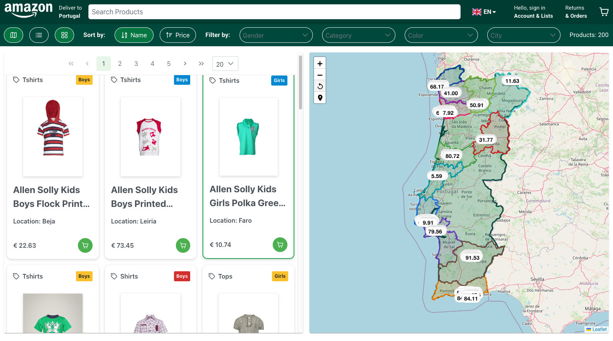
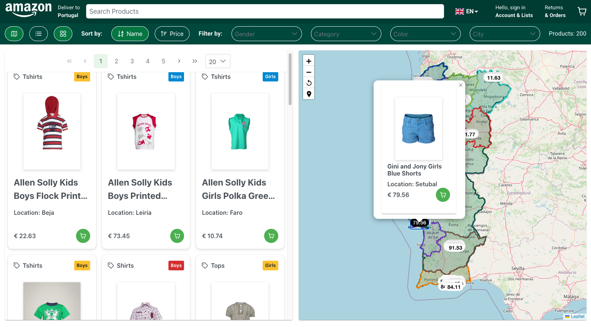
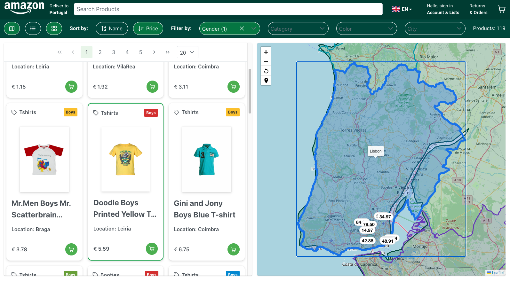
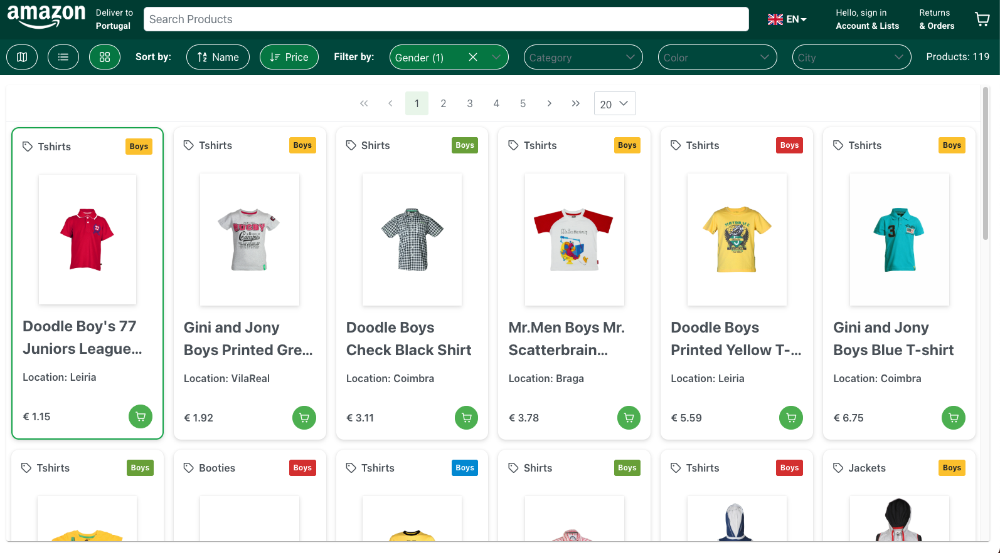
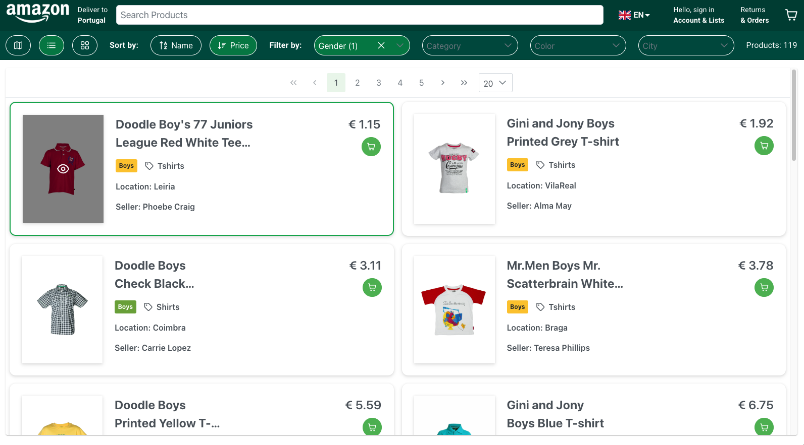

# Dynamic Amazon

This is a dynamic e-commerce project built with React and Material-UI (MUI) and Primereact. 

# 🧰 Tech Stack

| Technology | Purpose |
|------------|---------|
| React	| Frontend UI framework |
| React-Leaflet | Map engine |
| Leaflet | Geospatial rendering & marker system |
| Material UI | UI components |
| DataView | Custom renderCell layouts |
| Data Generation | Generator for demo data |
| Context API | Global state management |
| CSS | Styling & layout |

## Interactive DataView:

- Custom layout with company logo and detailed info
- Action buttons: Buy, Map
- Responsive and clean styling
- Top bar with total results and title
- Map Integration
- Each product includes coordinates for its location
- Can link to Google Maps or other map integrations
- Real-time map filtering

# Commands

```
-- Crrate App

user@mac mongodb % npx create-next-app@15 .

✔ Would you like to use TypeScript? … No
✔ Which linter would you like to use? › ESLint
✔ Would you like to use Tailwind CSS? … No
✔ Would you like your code inside a `src/` directory? … Yes
✔ Would you like to use App Router? (recommended) … Yes
✔ Would you like to use Turbopack? (recommended) … No
? Would you like to customize the import alias (`@/*` by default)? › No

-- Setup prettier and lint

npm i -D prettier eslint-config-prettier eslint-plugin-prettier

-- Copy files from nextjs-15-app-router

.env.local
.eslintrc.json
.prettierignore
.prettierrc
next.config.mjs

-- Setup package.json

  "scripts": {
    "dev": "next dev & sleep 2 && open http://localhost:3000/mongodb",
    "build": "next build && next export",
    "start": "next start",
    "lint": "next lint",
    "format": "prettier --write .",
    "predeploy": "echo > out/.nojekyll",
    "deploy": "gh-pages -d out"
  },

"repository": {
"type": "git",
"url": "git+https://github.com/devrazec/mongodb.git"
},

"homepage": "https://github.com/devrazec/mongodb",

-- Deploy

npm i -D gh-pages

npm run predeploy
npm run deploy

-- Create Files

gh-pages/.nojekyll
gh-pages/_next/.nojekyll

-- Material UI

npm i -S @mui/material @emotion/react @emotion/styled

-- Primereact UI

npm i -S primereact primeicons primeflex

-- Fonts

npm i -S @fontsource/roboto

import '@fontsource/roboto/300.css';
import '@fontsource/roboto/400.css';
import '@fontsource/roboto/500.css';
import '@fontsource/roboto/700.css';

-- Icons

npm i -S flag-icons @mui/icons-material iconsax-react @iconify/react react-icons

-- Components

npm i -S @mui/x-date-pickers dayjs @mui/x-data-grid @mui/x-data-grid-generator uuid

-- Maps

npm i -S leaflet leaflet-draw react-leaflet@next react-leaflet-cluster react-leaflet-draw

-- Database

npm i -S mongodb
npm i -S firebase
npm i -S better-sqlite3

```

# Web Interface

http://localhost:3000








# Demo

https://devrazec.github.io/mongodb
https://youtu.be/VBjqTNEf0zU
https://www.canva.com/design/DAG7MuFjm_I/G-UKytXgFrzB5Uha73sEGw/view?utm_content=DAG7MuFjm_I&utm_campaign=designshare&utm_medium=link2&utm_source=uniquelinks&utlId=h3668ad3a14#3

# Project

https://github.com/devrazec/mongodb

# HTTPS Project Files

https://github.com/devrazec/mongodb/tree/gh-pages

# Links

https://osm-boundaries.com/map
